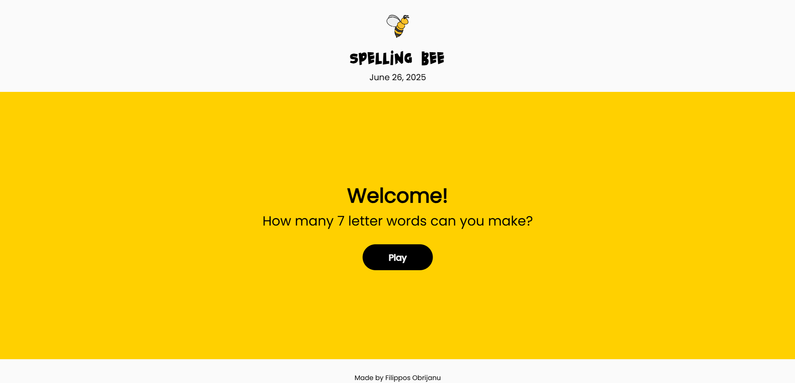
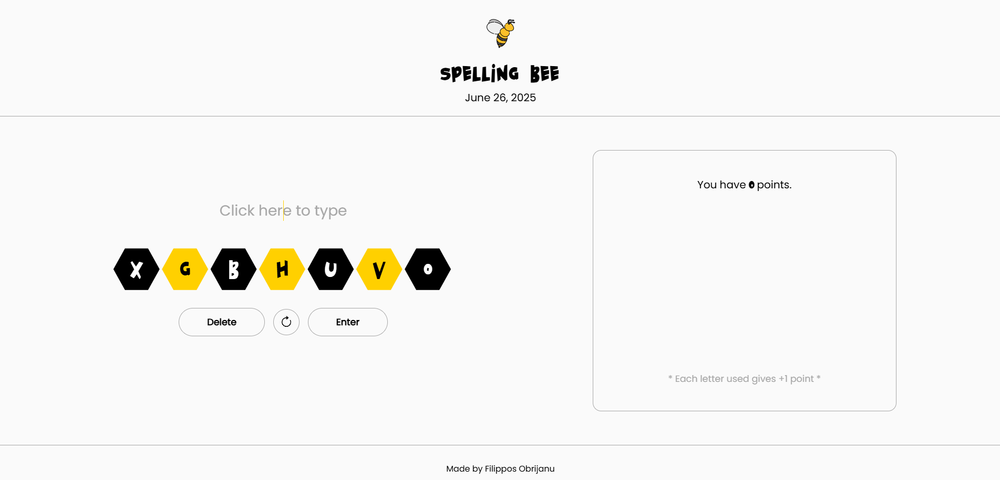

# 🐝 Spelling Bee App

Spelling Bee App is an interactive **web-based application** designed to challenge and improve users' spelling proficiency through a dynamic, gamified experience. The app presents carefully selected words from an **extensive JSON database** containing nearly every word in the English dictionary, ensuring a diverse and comprehensive vocabulary range. Users are prompted to spell words aloud or type them correctly, receiving instant feedback on their accuracy.

---

## 🛠️ Technologies Used

- **HTML5, CSS3, JavaScript**
- **Bootstrap 5** for responsive UI
- **VS Code** (development IDE)

---

## 📄 License

This project is open-source.

---

## 🤝 Contributing

Pull requests are welcome! Please follow standard GitHub flow and keep the code clean and documented.

---

## 📬 Contact

For questions, contact me at [obrizanou@gmail.com](mailto:obrizanou@gmail.com) or open an issue.
