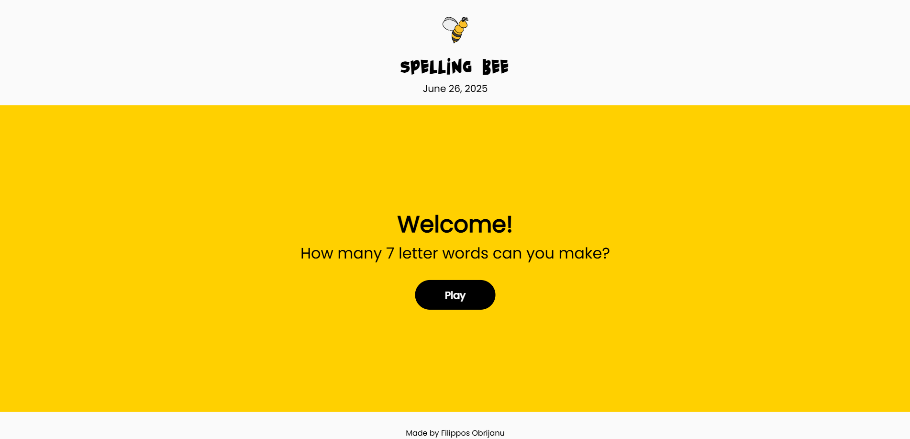
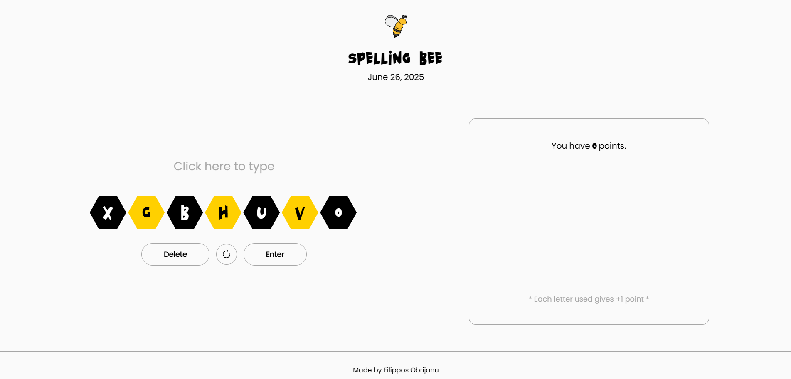

# Spelling Bee App

[](https://spelling-bee-appp.netlify.app/)
[](https://opensource.org/licenses/MIT)

An interactive, gamified web application designed to challenge and improve spelling proficiency. The app pulls from an extensive local JSON database of the English dictionary to provide a diverse and comprehensive vocabulary testing experience.



## ✨ Core Features

*   **Gamified Learning:** Tests users on their spelling accuracy with immediate, real-time feedback.
*   **Massive Vocabulary Database:** Parses a comprehensive JSON dictionary to dynamically generate random spelling challenges.
*   **Input Flexibility:** Prompts users to spell words aloud or type them directly into the interface.
*   **Responsive UI:** Fully optimized for desktops and mobile devices using Bootstrap 5.

## 🛠️ Built With

<p align="left">
  
  
  
  
  
</p>



## 🚀 Getting Started (Local Development)

To run this project locally on your machine, follow these steps:

1. **Clone the repository:**
```bash
   git clone [https://github.com/filipposobrijanu/Spelling-Bee-App.git](https://github.com/filipposobrijanu/Spelling-Bee-App.git)
